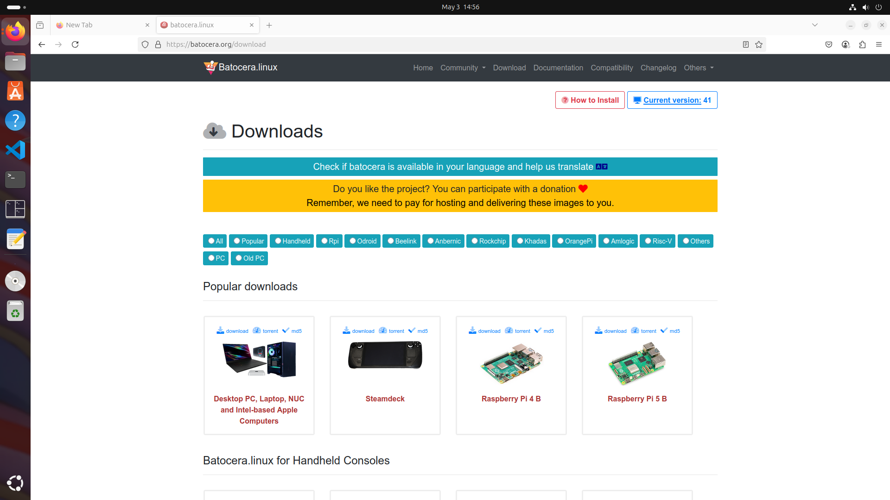
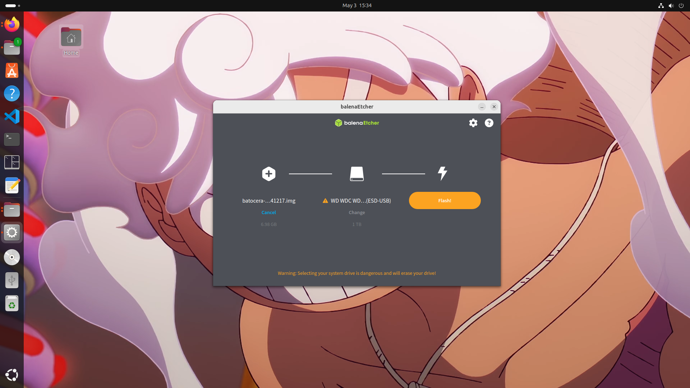

# Deliverable 2 – Installing and Using Batocera on Raspberry Pi

## 📦 Required Hardware

| Component               | Purpose                                                 |
|-------------------------|---------------------------------------------------------|
| Raspberry Pi 4 B        | The main device to run Batocera                         |
| External USB Drive      | To flash Batocera OS and store games                    |
| Ubuntu Computer         | To download and flash Batocera onto the external drive  |
| USB 3.0 Port            | Required for bootable drive performance on Pi           |
| HDMI Cable              | To connect Pi to a monitor or TV                        |
| USB Game Controller     | To navigate and play games                              |
| USB Keyboard (optional) | To assist with setup                                    |
| Ethernet/WiFi Adapter   | For internet access and updates                         |
| Balena Etcher           | To flash the iso image into the external drive
---

## 💾 How to Install Batocera on a Raspberry Pi

1. **Download Batocera OS for Raspberry Pi**
   - Go to: [https://batocera.org/download](https://batocera.org/download)
   - Choose `Raspberry Pi 4` and download the `.img.gz` file.
    
   

2. **Flash Batocera onto External Drive**
   - You can use [Balena Etcher](https://www.balena.io/etcher/) 
   
   - Select the proper batocera iso image and the external drive where you going to flash it. 

3. **Connect Everything to the Raspberry Pi**
   - Insert the external drive into a USB 3.0 port.
   - Connect HDMI, controller and mouse and keyboard if needed.

4. **First Boot**
   - Batocera will resize the partition and reboot automatically when you start the computer.

**Notes:**

- Make sure there is no MicroSD card inserted in the Raspberry Pi when connecting the external drive.
- When flashing the ISO make sure you picked the correct external drive.

---

## 🎮 How to Use Batocera

### Starting a Game
- Use your controller to navigate the system menu.
- Choose a console → Select a game → Press `A` or `Enter` to launch.

   

### Connecting Batocera to Internet
- Press `Start` → `Network Settings`
- Enable WiFi and enter your credentials, or plug in Ethernet.

   

### Updating Batocera
- Press `Start` → `Updates & Downloads` → `Start Update`
- Batocera will download updates and ask for a reboot.

   

### Scraping Games
- Scraping fetches cover art and descriptions.
- Press `Start` → `Scrape` → Configure options → Start
- Requires an internet connection.

  
### Stopping a Game
- Press `Hotkey + Start` (usually `Select + Start`) to quit and return to the menu.

   

### Using Save States
- Press `Hotkey + R1` to save the current state.
- Press `Hotkey + L1` to load the last save state.
- Useful for saving at any moment in the game.

  
---

