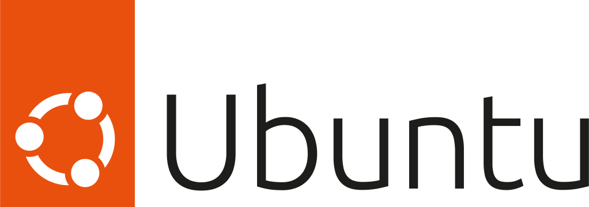
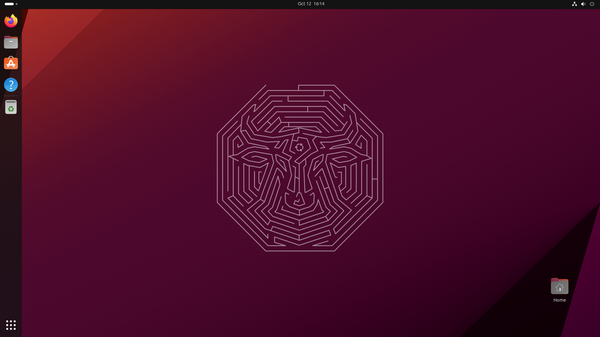

# Ubuntu



**Ubuntu** is a *Linux* distribution based on *Debian* and composed mostly of free and open-source software. **Ubuntu** is officially released in multiple editions: ***Desktop, Server,  and Core***  for Internet of things devices and robots. The operating system is developed by the British company Canonical, and a community of other developers, under a meritocratic governance model. As of October 2023, the most-recent release is 23.10 *("Mantic Minotaur")*, and the current long-term support release is 22.04 *("Jammy Jellyfish")*.

As with pther [Linux distributions](https://en.wikipedia.org/wiki/Linux_distribution), all of the editions can run on a computer alone, or in a [virtual machine](https://en.wikipedia.org/wiki/Virtual_machine). An upgrade to [Ubuntu] is released every six months, with long-term support (LTS) releases every two years. Canonical provides security updates and support for each [Ubuntu] release, starting from the release date until the release reaches its designated As with other Linux distributions, all of the editions can run on a computer alone, or in a virtual machine. end-of-life (EOL) date.



> **What is Debian?** Debian, also known as Debian GNU/Linux, is a Linux distribution composed of free and open-source  software and proprietary software developed by the community-supported Debian Project, which was established  by Ian Murdock on August 16, 1993. 
> Source https://en.wikipedia.org/wiki/Debian 

## Ubuntu Distributions
## Official distributions
* Desktop
* Edubuntu
* Kubunutu
* Lubuntu
* Xubuntu
* Ubuntu Unity
* Ubuntu Budgie
* Ubuntu Mate
* Ubuntu Studio
* Ubuntu Cinnamon
* Ubuntu Kylin

### Other
1. Ubuntu Cloud Images
2. Ubuntu Core
3. Ubuntu Server
4. Ubuntu Touch

### Unofficial distributions
* Ubuntu DDE
* Ubuntu Web

## Linux Commands
### Some Basic Linux Commands
* `Date:` displays the current time and date
* `cal:` displays a calendar of the current month
* `df:` displays the current amount of free space on our disk drives
* `free:` displays the amount of free memory
* `uname:` displays information about your system
* `clear:` clears the screen

### A Basic bash script

```
#!/bin/bash
echo "The current date and time: "
date
echo "Basic details about the PC"
uname -a
echo "Total free memory"
free -h
```

## Commands to navigate the filesystem

| command | Description                | 
| ------- | -------------------------- |
| ls      | list files and directories |
| pwd     | prints current directory   |
| cd      | change current directory   |